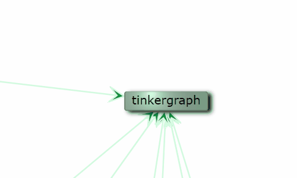
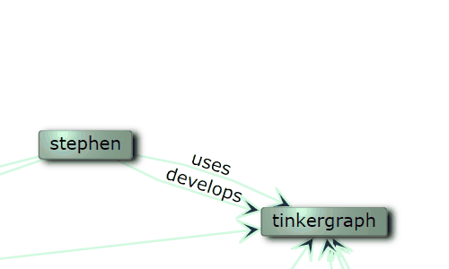
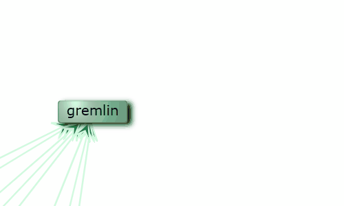
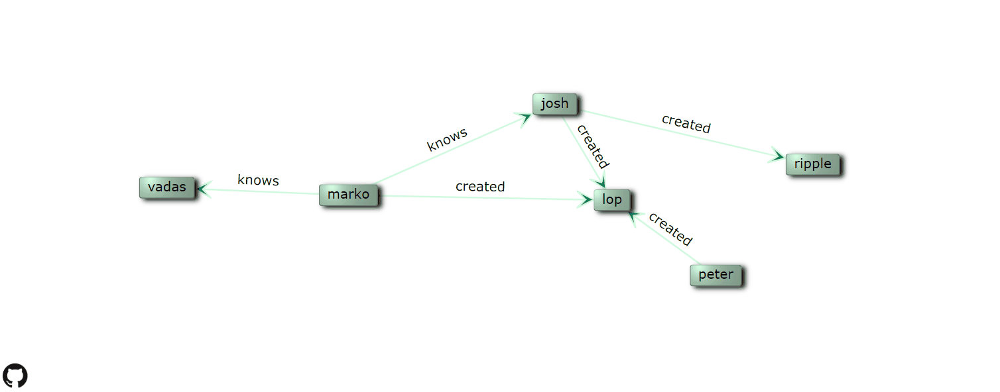
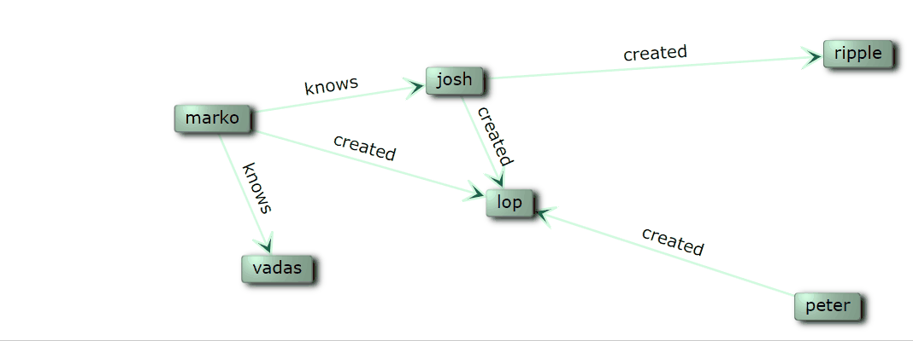
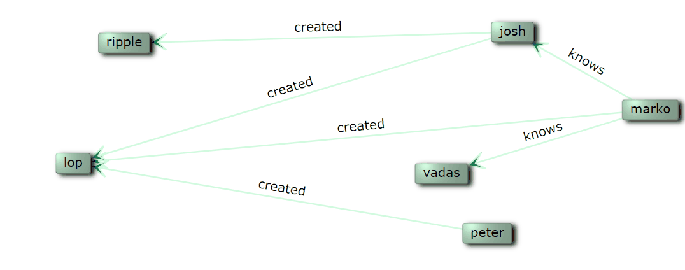

# graphysics
Graph with collision Physics, using SVG with style, Interactive Nodes mutations and cost based partial layout

# Live demo
https://networkgraphs.github.io/graphysics/

# Discussions Forum
get support, give feedback or simply chat to brainstorm about ideas right here on github with a special forum for this project

https://github.com/NetworkGraphs/graphysics/discussions

# Gif demo
## interactive light and shadow svg filters

## multi rank edges with labels on path

## animated radial context menu

## cost layout with sampling optimisation

## Nodes Collisions to ensure labels visibility

## Force attract neighbors

# Concepts

This project focus on small graphs, which node labels keep readable at all times within the given parent viewport dimensions.

Its main goal is to provide a fully autonomous front end webapp and webcomponent that requires no configuration. No drawing data required such as edge length, standard graph files are enough (Graphson, graphml,...).

A pure javascript approach is taken, no transpilers, no React, yet powerful template strings allow parametric html, css and svg integration in javascript.

Graphics rely on the SVG standard, which is fully interactive through live attributes updates, SVG filters and SVG animations. SVG allows styling with CSS classes and rules, therefore, for advanced web design, there are no restrictions to the power of CSS and no wrapping of style through a domain specific language.

Deep interactivity is provided out of the box for nodes drag, partial layout, focused force attractions, and nodes mutation (through groups and properties).

Graph exploration is planned to allow Gremlin query based graph expansion and filtering.

## Global Layout concept
>The Holy Grail of graph layout is to combine all the features of all the layouts but it's probably impossible.
> [Gordon Woodhull](https://github.com/dagrejs/dagre/issues/258#issuecomment-465255491) (Graphviz, Dagre)

In this project, the initial layout is performed with a cost based optimisation of multiple criteria with global random sampling. Although it is not possible to sattisfy all criteria all the time, with a cost based approach that alligns all criteria on a common cost scale, it should be possible to adjust the weight of each creteria when needed.

# Features
What is already available
* Layout
  * stochastic cost driven centrality placement
  * cost based edge intersection avoidance
  * Nodes physical collisions, no overlap
  * Neighborhood interaction forces
  * step by step demo layout with colred cost samples
* Grouping
  * group is a vertex with special edge relation "group"
  * allows all sorts of grouping, hierarchical and cross groups
  * Graph mutation to group and ungroup vertices
* Update Graph
  * Drag and drop .graphml and .json in Graphson Format
* SVG
  * shadows and light filters
  * inline html and css with classes
* Mouse and Touch
  * Highlight neighbors on vertex hover
  * Highlight path on edge hover
  * Drag Node position with touch
  * Context menu (touch empty area, then second touch on Node)
  * Hover states with touch Node then touch empty area

## Features Details
* Node
  * hover : highlight neighbors
  * drag node
* Node context menu
  * pin / unpin
  * re-layout pinning current node
* edges
  * layout with distance to edges cost
  * labels on path
  * edges arrows (on box-line intersection)
  * labels text path adapts to keep text upwards
  * multi-rank edges support
* Layout Forces
  * Keep Nodes horizontal
  * bring neighbors closer

# Plan
What is planned to be implemented in the Future
* Swap between :
  * proprties
  * nodes
  * groups
* Properties visualisation
  * shape
  * color
  * light
  * filter effect
* Graph Layout
  * use dot engine as a menu option
* Graph Explore
  * Query Gremlin server
  * reference node / edge Gremlin query
* Global hierarchical context menu
  * text input for queries
* Mouse and Touch
  * Pan zoom whole graph
  * Zoom vertices labels
* Performance
  * Analysis
  * Acceleration (wasm)

## Plan Details
* move the whole group when gragging the group vertex
* apply dot edge path (as long as no updates performed)
* highlight all path on edge hover
* multi points edge routing. In case an edge could shift to a certain extent in order to avoid intersection with vertices
* configure sampling number (in config file)
* polyline edges (complex concept, unclear and improvement might not be noticable)
Style in js :
* collect muliple css rules in one litteral string
* optionally add support for .dot import with [graphlib-dot](https://github.com/dagrejs/graphlib-dot)

# Ideas
* consider 3d interface such as [this button shadows example](https://lume.io/docs/#/examples/buttons-with-shadow)

# Development
* Physics engine : Matter.js (looking for wasm accelerated replacement)
* SVG : usage of parametric string template is enough to leverage the full power and professional documentation of the SVG standard, no bottleneck wrapper library and no alien syntax such as d3. Critical sections have direct update with setAttribute().

# Issues and limitations
* grouped node do not get a collision body
* some nodes collision fail with high node number (bug not related to performance)

# Existing Graph drawing tools
## Frameworks
* [Graphviz](http://www.graphviz.org/) : C++, SVG, dot language, Layout, Static, Community

dot language interpreter (powering plantUML), split in algo modules (dot, neato,...), [community forum](https://forum.graphviz.org/), SVG export, but static layout, no interactivity concept as it is an independent layout engine.

* [Gephi](https://gephi.org/) : Java, layout, analysis

State of the art graph editing and analysis, focus on big graphs, interface for Gremlin queries

## web libraries
* [Vis.js (Graphviz)](https://visjs.org/) : Canvas, Layout, interactive

Network module, canvas rendering, physics included, modular. limited interactivity (no context menu,no editing of view characteristics). User cannot fix nodes position. Library requires app dev for integration. Despite the active c++ Graphviz project, the js version is considered a hack (port not clean design) by the author, and link to the follow up project [Dagre](https://github.com/dagrejs). Nevertheless it is widely used and even has a wasm (web accelerated) version. [Graphviz wasm forum](https://forum.graphviz.org/t/graphviz-wasm-2-44-0/38), [graphviz-wasm](https://github.com/CyberhavenInc/graphviz-wasm), [npm graphvizlib.wasm](https://www.npmjs.com/package/@hpcc-js/wasm)

* [Dagre](https://github.com/dagrejs) : SVG d3, Layout, interactive, dot language, 2.3k + 2.8k stars

[interactive demo](https://dagrejs.github.io/project/dagre-d3/latest/demo/interactive-demo.html) zoom pan, style in dot, [exploration demo](http://cs.brown.edu/people/jcmace/d3/graph.html?id=small.json) with interactive context menu, multiple selections (neighbors, paths,...), partial layouting. Dagre is used by Cytoscape, TensorFlow,... CSS styling through d3.

* [Cytoscape](https://js.cytoscape.org/) : Canvas, interactive

Graph theory (network) library for visualisation and analysis. Canvas based. Cytoscape is a java based framework and the js front end has limited functionnalities, it is nevertheless a framework that allows all sorts of plugis ([Dagre](https://github.com/cytoscape/cytoscape.js-dagre), [Cola](https://github.com/cytoscape/cytoscape.js-cola),...) for layouting and other interactivity features.
* [Sigma.js](http://sigmajs.org/) : WebGL or Canvas, json gexf import, pan zoom highlight, 9k Stars

Facilitates web integration by importing standard graph formats (json, gefx), rendering based (webGL or Canvas). Interactivity limited to pan zoom and highlight of neighbor clusters, the user cannot move the nodes.
* [WebCola](https://github.com/tgdwyer/WebCola) : SVG d3, constraint based layout, interactive, MIT, 1.5 K stars

WebCola is a js Constrained Layout developed by a Australian research Lab [IALab](https://ialab.it.monash.edu/), 2D and 3D using three.js, support of grouping, constraints for no-overlap, stable dynamics, no context menu. WebCola is a js MIT rewrite of libcola which is a C++ lib part of LGPG [adaptagrams](http://www.adaptagrams.org/) libs which are used by Graphviz, Inkscape,...
* [yFiles for html](https://www.yworks.com/products/yfiles-for-html): Commercial, Complex licensing, Html5 and svg, Fully configurable, interactive

Advanced layout algos configuration, Hierarchical grouping, multiple sorts of diagrams and routing techniques. No neighborhood based interactivity (e.g. highlight neighbors). Prohibitively Complex licensing unusual for for Front end js webapps.

## Graph Databases
Although this project focus is small graphs limited to a number of nodes with viewable labels, the exploration part could be performed on a huge graph that is filtered and partially displayed through user exploration.
* [Tinkerpop](http://tinkerpop.apache.org) Apache project, Reference Graph database server, Gremlin traversal language.

* Graph Database list : OrientDB, ArangoDB, JanusGraph, Neo4j, Microsoft Azure Cosmos, Amazone Neptune

# References
Follow project up from [NetworkGraphs/graph2d](https://github.com/NetworkGraphs/graph2d)
## SVG CSS
* http://tinkerpop.apache.org/docs/3.4.4/dev/io/#graphson
* [SVG w3.org](https://www.w3.org/TR/SVG/Overview.html)
* [SVG Filters](https://developer.mozilla.org/en-US/docs/Web/SVG/Element/filter)
* [SVG Animations](https://svgwg.org/specs/animations/)
* [CSS Filters](https://developer.mozilla.org/en-US/docs/Web/CSS/filter)

## Graph Examples
* GraphSON_blueprints.json : [GraphSON library](https://github.com/tinkerpop/blueprints/wiki/GraphSON-Reader-and-Writer-Library)
* GraphSON_Tinker.json : [tinkerpop.apache](http://tinkerpop.apache.org/docs/current/reference/)
* LesMiserables.graphml : [Gephi](https://gephi.org/)

